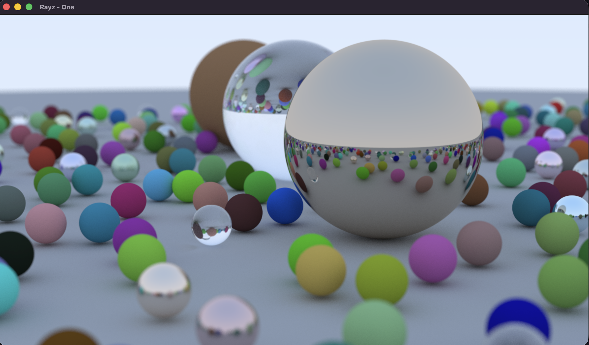
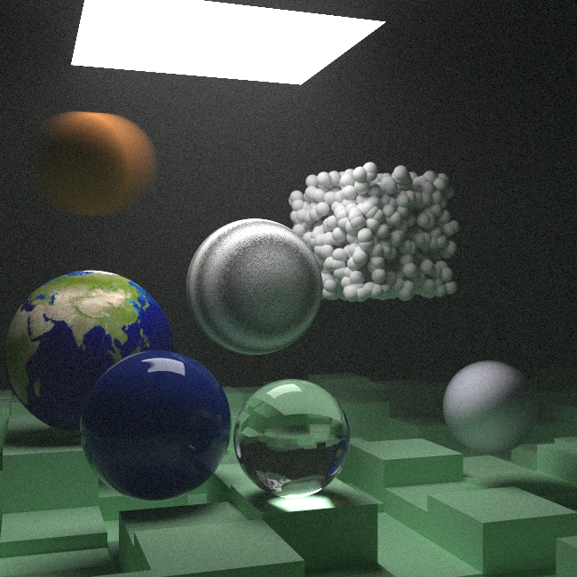
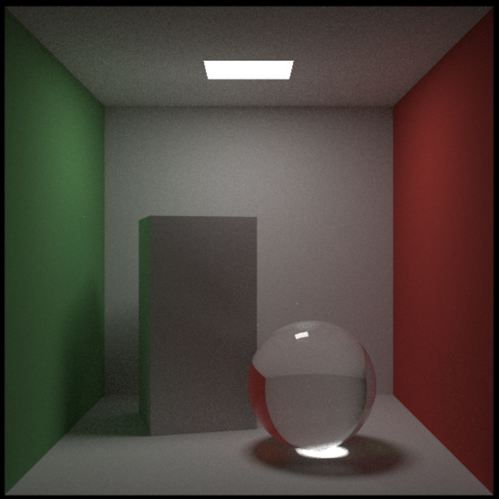

# rayz

Raytracing experiments.

## Usage

Run the main program:

```bash
zig build monte
# Or
zig build basic
```

## Demos

Final scene from Ray Tracing in One Weekend (took 1588.869s to render):


Final scene from Ray Tracing the Next Week (took 8523.922s to render):


Final scene from Ray Tracing the Rest of Your Life (took 237.713s to render):

